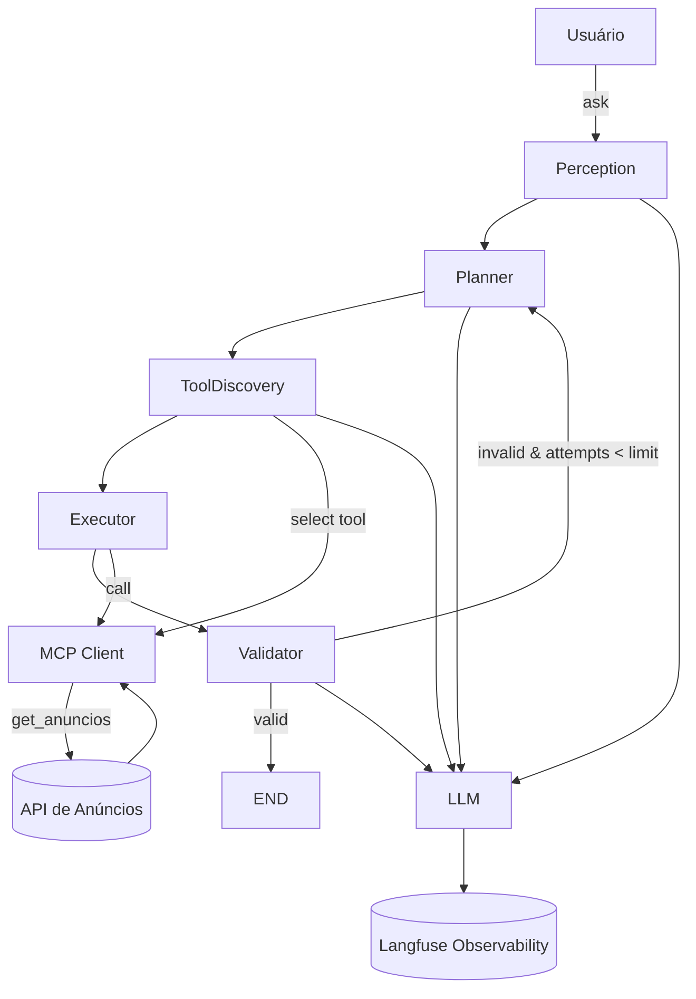

# 🤖 Arquitetura do Agent de Busca de Anúncios

Este documento descreve a arquitetura do seu **Agent com LangGraph + MCP + Ollama + Langfuse**, responsável por interpretar pedidos do usuário, planejar ações, escolher ferramentas e executar chamadas ao endpoint de **busca de anúncios**.

Seu agent segue um padrão moderno de **Agentic Workflow**, dividido em estágios bem definidos:

---

## 🧠 Visão Geral

O fluxo principal do agent é:

1. **Perception** – Entende a intenção do usuário.
2. **Planner** – Cria um plano de ação curto.
3. **Tool Discovery** – Escolhe a ferramenta correta via MCP.
4. **Executor** – Executa a tool (ex: `get_anuncios`).
5. **Validator** – Valida se a resposta atende o usuário.
6. **Retry Loop** – Caso inválido, o agent tenta novamente.

Tudo isso é orquestrado pelo **LangGraph** usando um `StateGraph`.

| Pilar               | O que significa na prática                 |
| --------------        | ------------------------------------------ |
| Perception        | Entender intenção + tipo de tarefa         |
| Planner            | Quebrar em passos executáveis              |
| Tool Discovery | Decidir quais ferramentas usar             |
| Tools               | Funções reais (API, DB, RAG, FS, HTTP etc) |
| Executor          | Orquestrar chamadas + estado               |
| Validator          | Verificar qualidade / segurança            |
| Reflection        | Aprender com erro                          |
| Retry               | Corrigir estratégia                        |
| Memory           | Persistir contexto                         |
| Observability    | Tracing, métricas, logs                    |

---

## 🧱 Componentes

### 🗣 LLM (ChatOllama)

* Modelo: `mistral`
* Responsável por raciocinar, planejar e selecionar tools.
* Integrado com **Langfuse** para observabilidade.

---

### 🔌 MCP Client

* Lista ferramentas disponíveis (`list_tools`).
* Executa ferramentas (`call`).
* No seu caso, expõe o endpoint `get_anuncios`.

---

### 🧠 State

```python
class State(TypedDict):
    ask: str
    perception: Optional[str]
    plan: Optional[str]
    tool_call: Optional[str]
    result: Optional[str]
    valid: Optional[bool]
    attempts: int
```

Esse estado é propagado entre os nós do LangGraph.

---

### 🧩 Nodes

| Node           | Função                             |
| -------------- | ---------------------------------- |
| perception     | Classifica intenção do usuário     |
| planner        | Cria um plano curto                |
| tool_discovery | Escolhe a tool via MCP             |
| executor       | Executa a tool e formata resultado |
| validator      | Valida a resposta                  |

---

### 🔁 Controle de Fluxo

O método `should_continue` controla se o agent:

* Finaliza (`END`)
* Ou tenta novamente (`retry`)

Com limite de tentativas.

---

## 🗺 Diagrama da Arquitetura



---

## ⚙️ Fluxo de Execução

1. O usuário envia uma pergunta.
2. O agent passa por **Perception**.
3. Cria um plano em **Planner**.
4. Seleciona uma ferramenta no **Tool Discovery**.
5. Executa no **Executor**.
6. Formata os anúncios.
7. Valida a resposta.
8. Finaliza ou tenta novamente.

---

## 🧪 Exemplo de Execução

Entrada:

> "List some ad or anuncios cars"

O agent:

* Detecta intenção de busca.
* Planeja: buscar anúncios.
* Escolhe `get_anuncios`.
* Executa via MCP.
* Limita com `data[:5]`.
* Formata resposta.

---

## 🚀 Evoluções Possíveis

* Paginação real (`take`, `skip`).
* Filtros por preço, cidade, marca.
* Memory de sessão.
* Ranking por relevância.
* Multi-agents (planner, searcher, formatter).

---

## ✅ Conclusão

Seu agent já segue uma arquitetura sólida de **Real World Agent** com:

* Observabilidade
* Tooling
* Planejamento
* Execução
* Validação
* Loop de correção

Ele está pronto para evoluir para um **Search / Marketplace AI Agent**.
